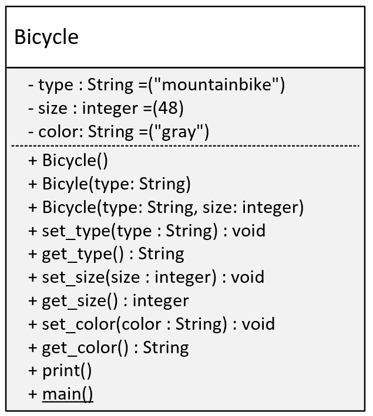
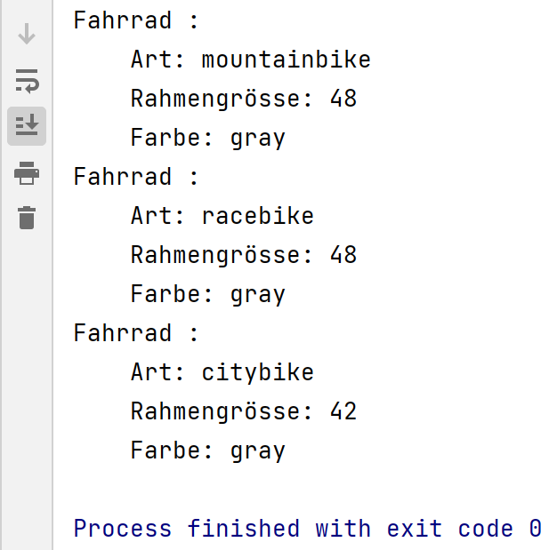

# Python-Template (Version 2023)
### Aufgabe 3 - Überladene Konstruktoren

#### Ziel

Sie können eine Klasse gemäss UML-Diagramm mit überladenem Konstruktor implementieren.

#### Auftrag 1

Gegeben ist das folgende Klassendiagramm

1. Übertragen Sie das Klassendiagramm in Python Code.
2. Codieren Sie alle setter und getter aus; die im Diagramm mit set_methodename vermerkten Methoden implementieren Sie bitte als “Property” mit den Annotationen `@property` und `@methodename.setter`!
3. Implementieren Sie die `main` Methode, so dass folgende Ausgabe resultiert. Nutzen Sie dabei das Wissen über parametrierte Konstruktoren und Default-Werte.

​     

#### Auftrag 2

Passen Sie den Code so an, dass des citybike die Farbe rot (red) aufweist. Dabei dürfen Sie aber nur in der `main`-Methode Hand anlegen. Konstruktoren oder Methoden dürfen nicht zugefügt oder geändert werden!

#### Abgabe

comming soon

#### Lösung
